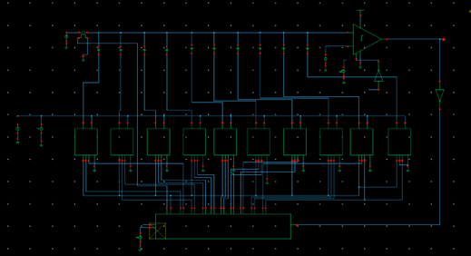
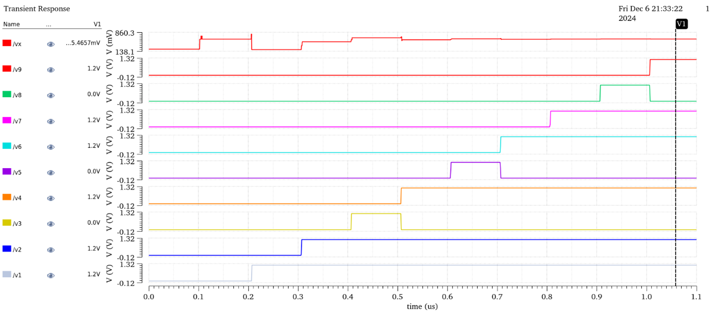
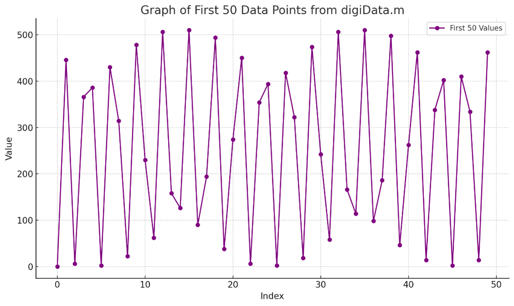
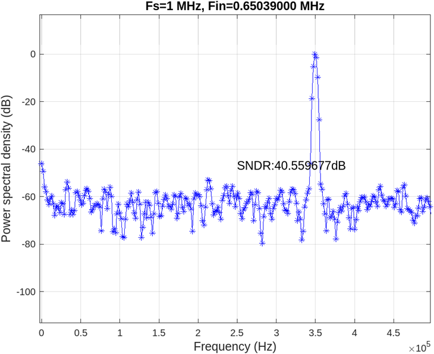

# 9-bit SAR ADC Design Project - ECE531

**Authors:** Iresh Jayawardhana, Danuka Malinda

---

## 1. Introduction

A Successive Approximation Register (SAR) ADC is a type of analog-to-digital converter that converts an analog signal into a digital output by iteratively comparing the input voltage with a reference voltage. It uses a binary search algorithm through a DAC and a comparator to determine the digital equivalent of the input signal with high accuracy and efficiency.

### 1.1 Background
- Overview of SAR ADC fundamentals.
- Rationale behind the chosen architecture.
- Significance in mixed-signal applications.

### 1.2 Design Specifications
- **Resolution:** 9 bits
- **Sampling Rate:** 1 MS/s
- **Supply Voltage:** 1.2 V
- **Process Technology:** GPDK 90nm
- **Simulation Tools:** Cadence Virtuoso

---

## 2. Methodology

The ADC is designed with GPDK90 PDK.
#### Circuit

### 2.1 SAR ADC Implementation
The ADC is divided into the following subsections:
- **Capacitor Array**
- **Comparator**
- **SAR Logic**
- **Ideal Switches**

---

## 3. Circuit Design

### 3.1 CS Capacitor Array
- Implemented using MIMCAP Ips from GPDK90 with a unit capacitance of 32fF to meet manufacturing limitations.
- Achieves uniformity using a multiplier for 2's multiple values.
- Top plate of capacitors connected to the comparator to reduce parasitic effects.

### 3.2 Comparator
- Designed for a voltage region of 0–1.2 V.
- PMOS transistors are sized to match NMOS counterparts for speed and current.
- Comparator operates on an inverted clock for updates during the falling edge of the master clock.

### 3.3 SAR Logic
- Composed of token pass registers, a register array, and controller logic.
- Operates with a 100ns clock for token passing and a 1µs clock for reset.
- Controller logic determines "Vref" and "gnd" states to maintain correct switching.

---

## 4. Simulation Results

### 4.1 Waveforms
#### Input Voltage: 0.6V
- **Output:** `100000001` (Expected: `100000000`)
- Minor discrepancy due to SAR logic limitations.

#### Input Voltage: 1.0V
- **Output:** `110101101` (Expected: `110101011`)
- Deviation caused by comparator performance limitations at small voltage differences.
#### Input Voltage: 1.0V

### 4.2 Observations
- Transients observed due to misalignments in switch timings.
- Ideal SNR: 55.94 dB
- Observed SNDR: 40.56 dB (Deviation: 15.38 dB)

### 4.3 Performance Metrics
- Conversion time: 10 clock cycles of a 10MHz clock.
- Sampling rate: 1 MS/s.

#### Sampled Wveform: sin waveform

#### FFT

---

## 5. Conclusion

The 9-bit SAR ADC design and implementation were successful, achieving a functional analog-to-digital conversion. Key issues include:
- Errors in the least significant bit (LSB) due to comparator sensitivity.
- Non-ideal switches were not considered, introducing potential delays and voltage drops.

### Future Work
- Enhance comparator stability and timing.
- Address non-ideal switch behavior.
- Optimize overall robustness of the design.

---

## 6. Lessons Learned

1. Be cautious when inserting components from libraries; incorrect selection can lead to significant debugging time.
2. Always verify default component values to ensure alignment with design specifications.
3. Understand input polarity when using ideal switch modules in Cadence AnalogLib.

---
